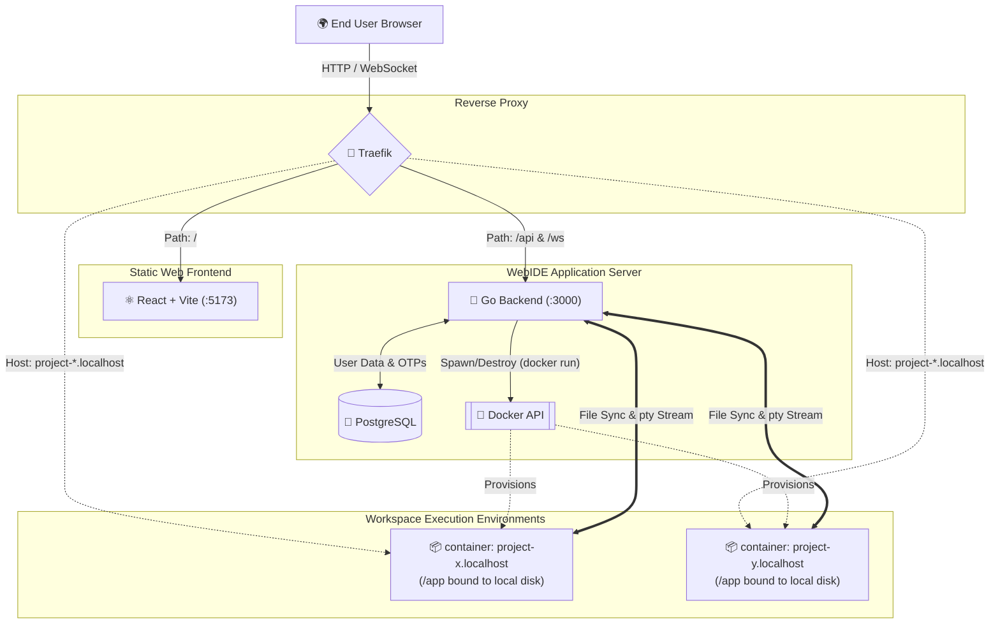

# WebIDE 🚀

A scalable, containerized Web-based Integrated Development Environment (WebIDE) built with Go, React, and Docker. 

## 🌟 Features
- **Browser-based Code Editor:** Powered by Monaco Editor (`@monaco-editor/react`).
- **Interactive Terminal:** Real-time fully functional terminal powered by Xterm.js (`@xterm/xterm`) and WebSockets over Docker PTY.
- **Dynamic Containerization:** Each project gets its own isolated Docker container environment (`node:22-alpine` by default).
- **Real-time Syncing:** Fast file-level and directory state syncing over WebSockets.
- **Dynamic Routing:** Automatic subdomain routing for running projects via Traefik (e.g. `http://project-<id>.localhost`).
- **Database Integrated:** PostgreSQL for user mapping, projects, OTP verification, and file hierarchies, utilizing GORM.

---

## 🏗️ System Architecture



### Frontend (⚛️ React + Vite + TypeScript)
- Built with modern web technologies: React, Vite, Tailwind CSS, Shadcdn UI.
- Communicates with the backend using REST APIs for file operations and User management.
- Maintains WebSocket connections with the server for XTerm.js terminal interaction and real-time editing.

### Reverse Proxy & Load Balancer (🚦 Traefik)
- Main entry point that intercepts incoming HTTP requests.
- `api` (`:3000/api`) and `ws` (`:3000/ws`) traffic is forwarded to the Go Backend.
- Default path `/` is forwarded to the Frontend at `5173`.
- Dynamically proxies `project-<id>.localhost` to individual Docker containers (started by the backend) utilizing Docker labels.

### Backend (🐹 Go + Gin)
- Manages HTTP REST API endpoints and Database schema via GORM + PostgreSQL.
- WebSocket Hub manages concurrent client connections on individual projects for file updates and broadcasts.
- Uses `docker exec` streams connected to a Pseudoterminal (PTY) to relay Linux Shell access to the Web client.
- Uses `docker run` to spawn temporary development environments isolated per project along with dynamically injected Traefik configuration parameters.

### Infrastructure & Execution (🐳 Docker & Postgres)
- Uses Postgres to manage User schemas, OTP models, Project records and Project Access variables.
- Uses the local Docker daemon to securely isolate project execution inside containers with bind mounts (`-v workspace:/app`) for efficient storage service operations.

---

## 🚀 Getting Started

### Prerequisites
- [Docker](https://www.docker.com/) and Docker Compose installed (Ensure the daemon is running).
- [Node.js](https://nodejs.org/) (for frontend execution) and `npm` or `bun`.
- [Go](https://go.dev/) (1.20+) installed.
- [PostgreSQL](https://www.postgresql.org/) database running locally.

### Setup Instructions

1. **Clone the repository**
   ```bash
   git clone <repo-url>
   cd webide
   ```

2. **Configure Environment Variables**
   Create a `.env` file in the `server` directory and add your Postgres credentials:
   ```env
   # server/.env
   DATABASE_URL=postgres://<user>:<password>@localhost:5432/<dbname>?sslmode=disable
   ```

3. **Start the Traefik Reverse Proxy**
   Start Traefik network and routing container via Docker Compose:
   ```bash
   docker compose up -d
   ```

4. **Run the Backend (Server)**
   ```bash
   cd server
   go run main.go
   ```
   *The server will start on port 3000. It requires privileges or setup to access the local Docker CLI.*

5. **Run the Frontend**
   ```bash
   cd frontend
   npm install # or bun install
   npm run dev # or bun run dev
   ```
   *The frontend runs locally on port 5173.*

6. **Access the Application**
   Open `http://localhost` in your browser. Traefik will route the traffic automatically between the Vite frontend and Go backend!

---

## 🔧 How It Works (Inner Workings)
1. User logs in via the Frontend interface and creates a new Project.
2. Go Backend initializes a new workspace directory for the target project natively and clones a Git repository if needed.
3. The Backend provisions a Docker container (`node:22-alpine`) and injects Traefik labels dynamically to map `<project-name>.localhost` into Traefik's routing tables.
4. When User clicks "Open Terminal", a WebSocket connection is established. The backend launches `docker exec -i <container> /bin/sh` wrapped in a PTY and pipes the Standard I/O streams directly into the web client through the socket interface.
5. While the User edits files, Monaco Editor sends file updates either as API calls or WebSocket events. The Go Backend receives changes and commits them directly into the target file on the local host filesystem, synced internally with the container via shared volumes.
